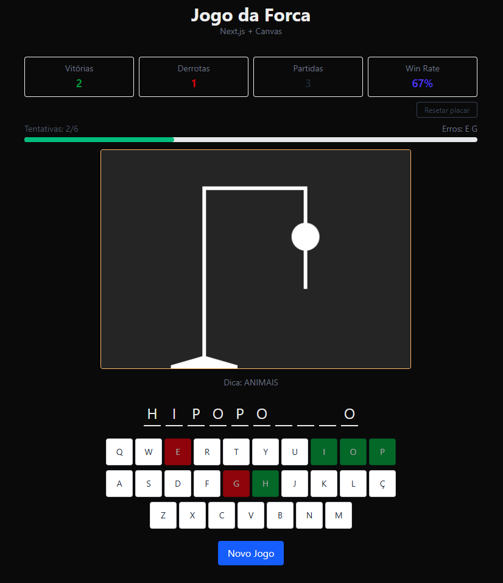

# 🎯 Next Hangman

Um jogo da forca desenvolvido com **Next.js 15**, **React** e **TypeScript**, inspirado no meu projeto original de 2022 feito em JavaScript puro e Canvas.  Agora com placar persistente no **localStorage** e design responsivo para jogar no desktop e no celular.

## 🚀 Demo

🔗 [Jogar agora](https://next-hangman-vert.vercel.app/)



## 🛠 Tecnologias utilizadas

- [Next.js 15](https://nextjs.org/)
- [React](https://react.dev/)
- [TypeScript](https://www.typescriptlang.org/)
- [Tailwind CSS](https://tailwindcss.com/)
- **LocalStorage API** (para salvar o placar)
- Canvas API (para desenhar a forca)

## 📌 Funcionalidades

- 🎮 Lógica completa do jogo da forca
- ⌨️ Teclado virtual **QWERTY** responsivo
- 🖌 Desenho dinâmico da forca via Canvas API
- 📱 Layout adaptável a diferentes tamanhos de tela
- 🏆 Placar com vitórias, derrotas e total de partidas (persistente)
- 🔄 Botão para resetar o placar
- 💡 Dica da palavra

## 📂 Estrutura do projeto

```
src/
├── app/               # Páginas e layout principal (Next.js App Router)
├── components/        # Componentes reutilizáveis
├── hooks/             # Hook personalizado com lógica do jogo
├── styles/            # Estilos globais
└── utils/             # Funções auxiliares e lista de palavras
````

## 📥 Instalação e uso

## Clonar repositório
```
git clone https://github.com/petersonros/next-hangman.git
```
## Entrar na pasta
```
cd next-hangman
```
## Instalar dependências
```
npm install
```
## Rodar em modo desenvolvimento
```
npm run dev
```
## Gerar build de produção
``` 
npm run build
```
## Servir a build localmente
```
npm start
```

## 🏅 Créditos

Este projeto é uma evolução do [Alura Challenge Oracle Hangman](https://petersonros.github.io/Alura_Challenge_Oracle_Hangman/), que desenvolvi durante o **ONE - Oracle Next Education** com a [Alura](https://www.alura.com.br/).

---

Feito por [Peterson](https://petersonros.com)
